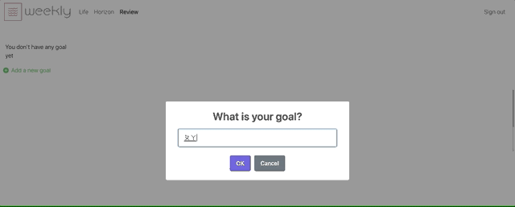
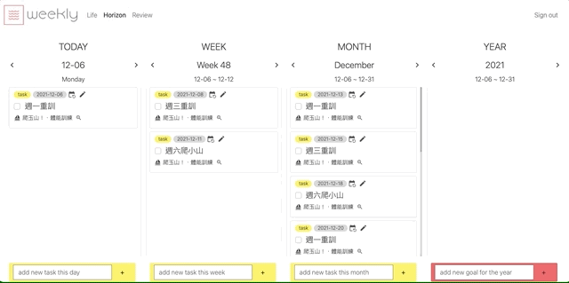
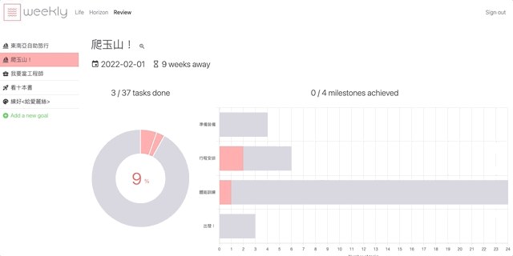
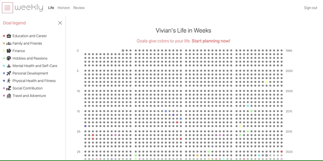
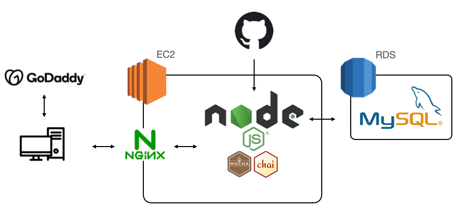
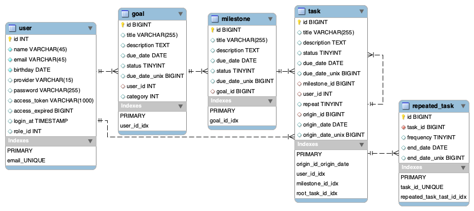

# WEEKLY

A life-goal planner designed to help users reach their dreams by incorporating tailored goal-oriented actions into their daily routine.

Try out [here](https://weeklytheplanner.com/)

## Table of Content

* [Features](#features)
* [Technologies](#technologies)
* [Contact](#contact)

## Features

### Goal planner

  

**Users can set goals, break them down into milestones and tasks**

* Create goal/milestone/tasks
* Due-date restraints between goal/milestone and milestone/task
* Repeat tasks daily/weekly/monthly

### Horizon spread

  

**A daily to-do spread that shows the present and future events, allowing goal-oriented time management**

* View the present (the selected date) and future events on the horizon spread, which consists of four columns: date, week, month, and year
* View and edit the planned goals and their tasks based on their due dates relative to the selected date
* Add independent tasks

### Goal review
  
**Users can review each of their individual goals and their progress**

* Completeness of the goal and milestones
* Remaining time until the due date in weeks

### Life in Weeks Calendar

  
**Users can get a bird’s-eye view of the meaningful achievements in their “Life in Weeks” calendar**

* Visualization of 80 years of life in weeks
* Label the goal's category for a balanced life
* check out the progress of each goal in a click

### Future Features

* Assign independent tasks to milestone
* Create new task/milestone/goal by copying from the existing ones 
* Share the goals with the community, allowing other to use them as templates
* Recommendation of courses bases on the goal categories

## Technologies

### Back-End

* Cloud service: AWS EC2
* Environment: Linus + Node.js
* Framework: Express.js
* User authorization: JWT
* Server-side render: EJS 
* Architecture  

### Front-End

* Javascript
* HTML
* CSS
* Bootstrap

### Database

* RDS+ MySQL
* Schema  

### Networking

* HTTP & HTTPS
* DNS: GoDaddy
* Proxy server: Nginx

### Tools

* Test: Mocha + Chai
* Data visualization: Chart.js

<!-- Try out [here](https://weeklytheplanner.com/) with the test account:  
email: weekly.test@mail.com  
password: weeklytest  
*write some note here* -->

## Contact

Author: Han-Hsien LEI  
Email: hanhsienlei@gmail.com